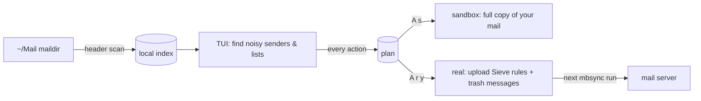

# sluice

A local terminal UI for keeping a mailbox clean with **Sieve rules**.

sluice reads your maildir, shows you which senders and mailing lists flood in (and how much of it
you never read), and turns them into delivery-time Sieve rules so the noise stops arriving. It can
also clean up the mail that's already piled up. Everything runs locally; the only things that
leave your machine are the Sieve upload and your normal mail sync.

> The rules are the point: they're the gate that keeps things clean from now on. Cleaning up old
> archives is secondary and usually a one-off.

```
 REAL  sluice  1 Candidates  2 Rules  3 Search  4 Plan          plan: 1 rules · 1357 msgs ✓  97037 msgs indexed
group by domain · sort score · 5150 groups
   score   90d  total  unrd bhole  news trash rule       from_domain              latest subject
    1437  1241   1357   91%     0     0     0 trash*     mail.beehiiv.com         The 30-Year Hit a 2004 High…
     542   434    434  100%     0     0     0            news.loritevoclub.com    Satellite Confirms: Elon…
     394   435    662   65%     0     0     0            news.alexdatastream.com  MAJOR BUY ALERT: Elon/AI…
```

## How it works

**Plan first, then apply.** Nothing you do in the TUI touches your mail or your Sieve server
directly. Every rule you add and every batch of messages you choose to trash goes into a **plan**,
which is saved to disk. When you're happy with it, you **apply** the plan: first to a sandbox, then
to your real mail.



- **Rules** go into a clearly marked block of your Sieve script. sluice never edits anything
  outside that block, so your hand-written rules are safe.
- **Trash** means moving messages into your trash folder (`Deleted Messages` by default). sluice
  never deletes a message file. Every move is logged, and the last batch can be undone.
- **The sandbox** is a complete copy of your mailbox. On btrfs it uses reflinks, so copying ~100k
  messages takes about 3 seconds and almost no disk space. Applying a plan there first shows you
  exactly what would happen. The plan is marked ✓ *validated* until you change it again.
- **Uploads check for drift:** if the Sieve script on the server doesn't match your local copy (say
  you edited it somewhere else), sluice stops rather than overwriting it.
- **Only one Sieve script can be active.** sluice uploads the whole `kolab` script (your text
  unchanged, its own block regenerated) and activates it. If the server has no script yet, the first
  apply creates it. sluice never silently switches off a different active script: if one exists,
  the apply either stops or asks you to confirm the switch.

## Drop to block: the `+Sluice` folder

The easiest way to use sluice is from any mail client, including your phone. **Move an unwanted
message into the `+Sluice` folder.** The sweep service notices it after the next sync and:

1. **Adds a rule** so mail like it goes straight to the trash from now on. It matches the message's
   mailing list (`List-Id`) if it has one, otherwise the exact sender address. It never blocks a
   whole domain on its own.
2. **Queues cleanup** of mail you already have from that list or sender, as a plan item you review
   and apply like any other (`A` in the TUI).
3. **Moves your dropped message to the trash**, so an empty `+Sluice` means everything's been handled.

If the sender is someone you've sent mail to, or one of your own addresses, sluice doesn't publish
anything. It puts the rule and the cleanup in your plan for review instead (marked *held*). If
publishing fails, the message stays in `+Sluice` and is tried again on the next sweep.

Run it as a service on the machine that holds your synced mail:

```sh
make install-service   # installs sluice and a systemd user unit, then starts `sluice sweep -watch`
make service-logs      # follow what it's doing (each sweep logs a `timing:` line)
sluice sweep           # or process the folder once by hand (`:sweep` in the TUI)
```

The service creates `+Sluice` locally if it's missing, and mbsync creates it on the server
(`Create Both`). `sluice doctor` shows whether all of this is set up, under **sweep**.

## Requirements

Run **`sluice doctor`** to check all of this on your machine. It tells you what's missing and how to fix
it, and which features (browse & plan / apply to sandbox / apply to real) you can use right now.
`sluice doctor -online` also logs in to your Sieve server to confirm your script exists, is active,
and matches your local copy. It runs your password command, so it may prompt.

- Linux; Go 1.27+ to build.
- A **maildir kept in sync by mbsync** (isync). sluice follows mbsync's rules for moving files
  (it strips the `,U=` UID from filenames) and holds the same lock file your sync uses, so the two
  never run at the same time. For moves to reach the server, your mbsync config needs:
  - a `MaildirStore` whose `Path` is your `mail_root`
  - `Sync All`, or any setting that includes Push, so local changes are uploaded
  - `Expunge Both` (or `Far`), so originals are removed from the server instead of left marked deleted
- Your sync run through `flock` on the lock file (e.g. `flock $XDG_RUNTIME_DIR/mbsync.lock mbsync …`).
- A trash folder that already exists in the maildir (`Deleted Messages` by default).
- A server with **ManageSieve** support (port 4190, STARTTLS). sluice talks to it directly; no extra
  tools needed.
- Your mail login and a command that prints your password (for example, reading it from a password
  manager; the default is `mail-pass`). Set `user` to your login (the built-in default is the
  author's); if you set it to `""`, sluice runs `user_cmd` (default `mail-user`) every time instead,
  which can mean waiting on a password-manager prompt.
  The password stays in memory only for the one server session and is never written anywhere.
- Optional, but recommended: the mail folder and `~/.local/share` on the same **btrfs** filesystem,
  so sandbox copies are near-free. On other filesystems the sandbox is a full copy.

## Install

```sh
make install          # runs checks, builds, installs to ~/.local/bin/sluice
sluice doctor         # check this machine meets the requirements
```

## Quick start

```sh
sluice doctor         # green across the board?
sluice -scan          # build the index and print the top candidates
sluice                # open the TUI on your real mail (still plan-first)
```

1. On **Candidates**, press `gd` to group by sender domain. The noisiest senders you ignore are at the top.
2. Press `t` on a row to plan a trash rule. sluice then offers to plan trashing the messages you
   already have from that sender (`y`).
3. Check the **Plan** tab (`l` until you reach it, or `4gt`).
4. Press `A`, then `s`: sluice makes a fresh sandbox copy, applies the plan there and shows a report.
   Run `sluice -sandbox` if you want to browse the result.
5. Before your first real apply, run `sluice doctor -online`. Then press `A`, then `r`, then `y`
   to apply to your real mail and Sieve server. mbsync sends the moves to the server on its next run.

## Keys (vim-style)

Press `?` in the TUI for the full list for the screen you're on.

| | |
|---|---|
| Tabs | `h`/`l`, `gt`/`gT`, `{n}gt` |
| Move | `j`/`k`, `gg`/`G`, `{n}G`, `ctrl+d`/`ctrl+u`, `ctrl+f`/`ctrl+b`, `H`/`M`/`L`, `zz`/`zt`/`zb`, `ctrl+e`/`ctrl+y`; counts work (`5j`) |
| Find | `/` then type, `n`/`N` for next/previous |
| Select | `V` to select a range of rows, `space` to mark one row, `esc` to clear |
| Candidates | `t` trash rule · `f` file into folder · `r` mark-read rule · `x` trash existing mail · `enter` details · `gl`/`gd`/`gs` group by list/domain/sender · `s`/`S` sort · `zh` hide groups that already have rules |
| Rules | `dd` remove · `x` trash existing mail that matches |
| Search | `/` edit the query · `X` trash all matches |
| Plan | `dd` drop an item · `enter` show its messages · `D` discard the whole plan |
| Everywhere | `A` apply · `u`/`ctrl+r` undo/redo plan changes · `U` undo the last applied trash batch · `:` command line · `R` rescan · `q`/`ZZ` quit |

**Search query language** (Search tab or `:search`): `from:` `domain:` `list:` `folder:` `subject:`
`before:YYYY-MM-DD` `after:YYYY-MM-DD` `older:90d|6m|1y` `unread` `read`, plus bare words.
Example: `domain:beehiiv.com older:1y unread`.

**Commands** (`:` then tab to complete): `:apply [sandbox|real]`, `:group list|domain|sender`,
`:sort score|90d|total|unread`, `:filter TEXT`, `:hide`/`:nohide`, `:search QUERY`, `:w PATH`,
`:discard`, `:undo`, `:redo`, `:rescan`, `:sweep`, `:doctor`, `:version`, `:tab N`, `:{n}`, `:q`.

## Command line

```
sluice [-config PATH] [-plan PATH] [-sandbox | -reset-sandbox] [-scan | -apply [-yes]]
sluice doctor [-online] [-config PATH]
sluice sweep [-watch] [-sandbox] [-plan PATH] [-config PATH]
sluice version
```

| flag | effect |
|------|--------|
| *(none)* | TUI on real mail |
| `-sandbox` | TUI on the sandbox (makes the copy first if there isn't one) |
| `-reset-sandbox` | re-copy the sandbox from your current mail, then act as `-sandbox` |
| `-scan` | update the index, print the top candidates, exit |
| `-apply` | print the plan, ask y/N, apply it, print a report (`-yes` skips the question) |
| `-plan PATH` | use a different plan file |
| `-config PATH` | use a different config file |
| `doctor` | check the requirements; exits 1 if anything fails. `-online` also checks the Sieve server |
| `sweep` | process the training folder once; exits 0 (done), 3 (mail was moved) or 1 (error). `-watch` keeps running as a service |
| `version` (or `-version`) | print the version, commit, branch and build time |

## Configuration

`~/.config/sluice/config.toml` is optional; these are the defaults:

```toml
mail_root         = "~/Mail/kolab"
trash_folder      = "Deleted Messages"
exclude_folders   = ["Drafts", "Sent Messages", "Sent Items"]   # never indexed
blackhole_folders = ["+SaneBlackHole"]                          # counted as "ignored" mail
news_folders      = ["+SaneNews"]                               # counted as half-ignored
lock_file         = "$XDG_RUNTIME_DIR/mbsync.lock"              # the same lock your sync uses
sieve_file        = "~/.config/sieve/kolab.sieve"
sieve_server      = "imap.kolabnow.com"
sieve_script      = "kolab"
sieve_port        = 4190
user              = "james@fryman.io"                           # your login (skips user_cmd); set "" to use user_cmd
user_cmd          = ["mail-user"]                               # only used when user is empty
pass_cmd          = ["mail-pass"]
sandbox_dir       = "~/.local/share/sluice/sandbox"             # must end in /sandbox
training_folder   = "+Sluice"                                   # drop-to-block folder
sent_folders      = ["Sent Messages", "Sent Items"]             # people you've written to are never auto-blocked
sweep_interval    = "5m"                                        # how often the service rechecks, besides reacting to new mail
post_sweep_cmd    = ["mail-sync"]                               # sync right after a sweep moves mail ([] = wait for the timer)
```

Files sluice keeps:

| path | what |
|------|------|
| `~/.cache/sluice/index.db` | header index (safe to delete; rebuilt on the next run) |
| `~/.local/state/sluice/plan.json` | the current plan (real and sandbox modes share it) |
| `~/.local/state/sluice/applied/` | copies of plans that have been applied to real |
| `~/.local/state/sluice/journal.jsonl` | log of trash moves, used by undo |
| `~/.local/state/sluice/sweep.jsonl` | what each sweep did with each dropped message |
| `~/.local/share/sluice/sandbox/` | the sandbox (safe to delete) |

## What sluice writes to your Sieve script

```sieve
# >>> sluice managed block — edit via sluice >>>
# sluice: {"kind":"domain","value":"mail.beehiiv.com","action":"trash","added":"2026-09-24"}
if address :domain :is "from" "mail.beehiiv.com" {
    addflag "\\Seen";
    fileinto "Deleted Messages";
    stop;
}
# <<< sluice managed block <<<
```

The block goes right after your first `require` line, so its rules run before your own. sluice adds
`fileinto` and `imap4flags` to your `require` list if they're missing. A rule can match on:
- **list:** the `List-Id` header contains a value
- **domain:** the sender's domain is exactly a value
- **sender:** the sender's address is exactly a value

A rule can do one of three things:
- **trash:** mark read and move to the trash folder
- **file:** move into a folder you already have
- **read:** mark read and leave in place

## Development

```sh
make            # gofmt check, vet, test, build bin/sluice
make watch      # rerun that on every save
make dev        # TUI on the sandbox
make dev-reset  # re-copy the sandbox from your current mail
make version    # the version the next build will be stamped with
```

Builds made with `make` are stamped with `git describe --tags --always --dirty`, the commit, the
branch and the build time. `sluice version` shows them. Releases are git tags like `v0.1.0`.

The code is in `internal/`, split into `config`, `maildir`, `index`, `query`, `cleanup`, `sieve`,
`plan`, `sandbox` and `tui`. Design notes, invariants and decisions live in [`lode/`](lode/lode-map.md).

## Status

Everything works end to end against the sandbox, and there are tests for the parts that change
mail or your Sieve script. **Applying a plan to a real server hasn't been tried yet**, so start
with one rule and a small batch of trash.

A few things to expect:
- mbsync sends a move to the server as "upload the message again, then delete the original", so
  trashing a lot of archive mail makes for a long next sync.
- If your Sieve server can't create folders (KolabNow can't), file-into rules can only target
  folders that already exist.
