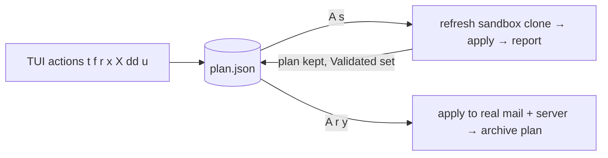

# Plan-first model

Package: `internal/plan`. Related: [sandbox.md](sandbox.md), [../sieve/remote.md](../sieve/remote.md),
[../cleanup/search-and-trash.md](../cleanup/search-and-trash.md), [../tui/summary.md](../tui/summary.md).

Nothing in the TUI touches mail or the Sieve server directly. Every action is recorded in a single
pending **plan**; the plan is applied explicitly — to the sandbox to validate, then to real.



## Shape (persisted as JSON, autosaved on every change)
```go
type Plan struct {
  Version   int
  Rules     []RuleOp    // deltas against whatever sieve file the target has
  Trash     []TrashItem // frozen message lists, exactly what was reviewed
  Validated *time.Time  // last successful sandbox apply of this exact plan content
}
type RuleOp struct { Op string /* "add" | "remove" */; Rule sieve.Rule }
type TrashItem struct { ID, Label string; Refs []Ref }
type Ref struct { Key, Folder string }
```
Path: `$XDG_STATE_HOME/sluice/plan.json` (the **real** state dir, shared by real and sandbox
modes so a plan built in either can be applied to either). `-plan PATH` overrides.

## Invariants
- Trash items store message **keys**, not queries: applying never trashes mail you didn't review.
  Mail that arrived after planning is untouched; refs no longer present are reported as skipped.
- A key appears in at most one trash item (adding dedupes; the confirm reports how many were new).
- Rule ops are deltas: `add` upserts, `remove` deletes by (kind, value). A later op on the same
  (kind, value) replaces the earlier op. An `add` of a rule identical to the target's published rule
  and a `remove` of a rule the target doesn't have are no-ops at apply time.
- Any edit to the plan clears `Validated`.
- Applying to real archives the plan to `$XDG_STATE_HOME/sluice/applied/<ts>.json` and resets it
  to empty. Sandbox applies never consume the plan.

## Server precheck (real)
When the plan changes the sieve script (`Target.ChangesSieve`), the REAL confirmation first runs
`Publisher.Status` and shows the server facts. Drift, or our script missing while another is
active, turn the dialog into an info box with no apply key. If another script is active and ours
exists, the dialog warns and `y` sets `Target.AllowSwitchFrom` to that name, which `Publish`
re-verifies against a fresh `--list`. Headless `-apply` does the same; `-yes` refuses a switch.
See [../sieve/remote.md](../sieve/remote.md#server-model).

## Apply (`plan.Apply(p, target) Report`)
1. Rules: read target sieve file → `sieve.Parse` → apply ops → render. If text changed, publish via the
   target's publisher (real: native ManageSieve session; sandbox: file publisher). Publish failure aborts the
   whole apply before any mail moves.
2. Trash: all refs from all items in **one** cleanup batch (so `U` undoes the entire apply).
   `Ref.Folder` + key are resolved against the target maildir (paths are never trusted).
3. Report: per-rule log, per-item moved/skipped counts, first few skip reasons.

Headless: `sluice -apply` (real) or `sluice -sandbox -apply` prints the summary, asks `y/N` on
stdin (skip with `-yes`), applies, prints the report.
