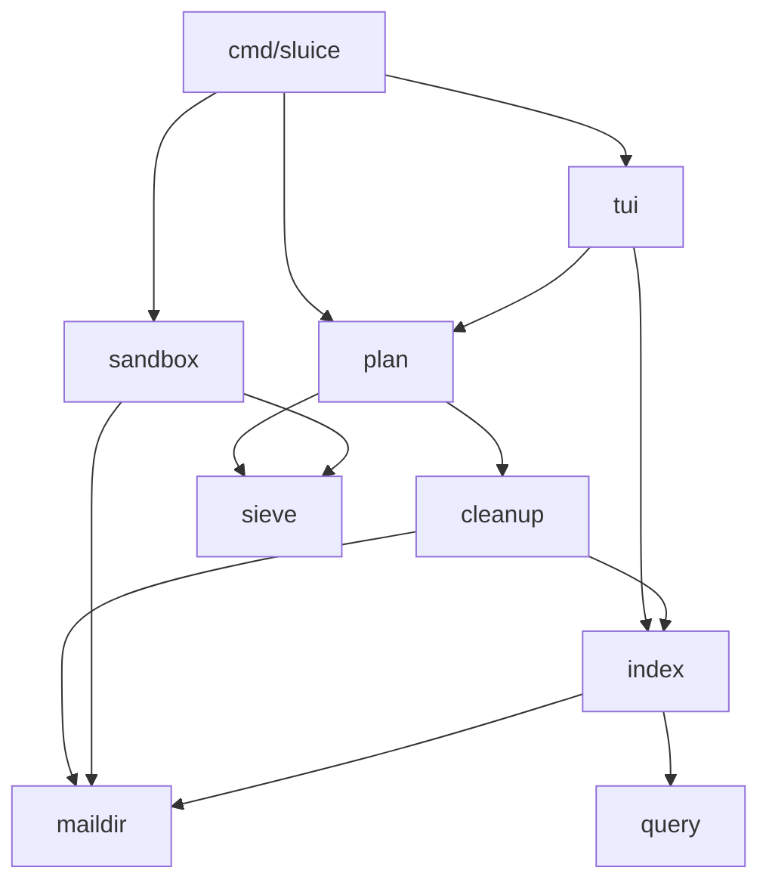

# Architecture

Single binary `cmd/sluice`. Dependency direction: `tui` → everything; `plan` → `cleanup`, `sieve`,
`index`; `cleanup` → `maildir`, `index`; `sandbox` → `config`, `maildir`, `sieve`; `sieve`, `query`,
`config` are leaves.



| package            | responsibility | lode |
|--------------------|----------------|------|
| `internal/config`  | TOML config + defaults, XDG paths | this file |
| `internal/maildir` | folder walk, filename parse, header parse, locked move | [mail/maildir-and-mbsync.md](mail/maildir-and-mbsync.md) |
| `internal/index`   | SQLite cache, scan, groups, search, lookups by key | [mail/index.md](mail/index.md) |
| `internal/query`   | search language → SQL | [cleanup/search-and-trash.md](cleanup/search-and-trash.md) |
| `internal/cleanup` | trash batches, journal, undo | [cleanup/search-and-trash.md](cleanup/search-and-trash.md) |
| `internal/sieve`   | managed block edit, native ManageSieve client, `Publisher` (server / file) | [sieve/managed-block.md](sieve/managed-block.md), [sieve/remote.md](sieve/remote.md) |
| `internal/plan`    | plan model, persistence, apply to a target | [apply/plan.md](apply/plan.md) |
| `internal/sandbox` | full reflink clone environment | [apply/sandbox.md](apply/sandbox.md) |
| `internal/sweep`   | training folder → rules + queued cleanup; watch loop | [sweep.md](sweep.md) |
| `internal/timing`  | stage-duration recorder for one-line timing logs | [sieve/remote.md](sieve/remote.md#timing) |
| `internal/version` | build metadata (ldflags-stamped, VCS fallback) | [development.md](development.md#versioning) |
| `internal/doctor`  | requirement checks → capabilities + fixes | [doctor.md](doctor.md) |
| `internal/tui`     | Bubble Tea screens | [tui/summary.md](tui/summary.md) |

## Config
Optional `~/.config/sluice/config.toml`; every key has a default:
```toml
mail_root       = "~/Mail/kolab"
trash_folder    = "Deleted Messages"
exclude_folders = ["Drafts", "Sent Messages", "Sent Items"]
blackhole_folders = ["+SaneBlackHole"]
news_folders    = ["+SaneNews"]
lock_file       = "$XDG_RUNTIME_DIR/mbsync.lock"
sieve_file      = "~/.config/sieve/kolab.sieve"
sieve_server    = "imap.kolabnow.com"
sieve_script    = "kolab"
sieve_port      = 4190
user            = "james@fryman.io"                 # login (skips user_cmd: no 1Password round trip); "" → user_cmd
user_cmd        = ["mail-user"]
pass_cmd        = ["mail-pass"]
sandbox_dir     = "$XDG_DATA_HOME/sluice/sandbox"   # must end in /sandbox
training_folder = "+Sluice"                         # drop-to-block folder (see sweep.md)
sent_folders    = ["Sent Messages", "Sent Items"]   # recipients here are never auto-blocked
sweep_interval  = "5m"                              # watch-mode rescan fallback
post_sweep_cmd  = ["mail-sync"]                     # after a sweep moved mail; [] waits for the timer; never run in -sandbox
```
Derived paths (real): index `$XDG_CACHE_HOME/sluice/index.db`, journal
`$XDG_STATE_HOME/sluice/journal.jsonl`, plan `$XDG_STATE_HOME/sluice/plan.json`, applied-plan
archive `$XDG_STATE_HOME/sluice/applied/`. Sandbox mode redirects everything except the plan into
`sandbox_dir` (`sandbox.Config`).

CLI:
| flag | effect |
|------|--------|
| (none) | TUI on real mail (plan-first) |
| `-sandbox` | TUI on the sandbox; clones it first if missing |
| `-reset-sandbox` | re-clone, then as `-sandbox` |
| `-scan` | update the selected env's index, print top candidates, exit |
| `-apply [-yes]` | print plan, confirm on stdin (unless `-yes`), apply to the selected env, print report; real applies archive the plan |
| `-plan PATH` | use another plan file |
| `-config PATH` | config file |
| `sweep [-watch] [-sandbox] [-plan]` | process the training folder once (exit 0/3/1) or as a service — see [sweep.md](sweep.md) |
| `version` / `-version` | print build metadata (see [development.md](development.md#versioning)) |
| `doctor [-online]` | subcommand (dispatched before flag parsing): requirement report, exit 1 on failure — see [doctor.md](doctor.md) |
Build/test/sandbox: see [development.md](development.md) (`make`, `make watch`, `make dev`).
