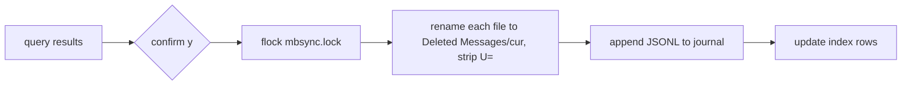

# Search and trash (archive cleanup)

Packages: `internal/query` (parser → SQL), `internal/cleanup` (moves + journal).
Related: [../mail/maildir-and-mbsync.md](../mail/maildir-and-mbsync.md), [../mail/index.md](../mail/index.md).

## Query language
Space-separated terms, AND-ed. Values may be quoted (`subject:"weekly digest"`).

| term              | meaning                                       |
|-------------------|-----------------------------------------------|
| `from:x`          | from_addr contains x                          |
| `domain:x`        | from_domain = x or ends with `.x`             |
| `list:x`          | list_id contains x                            |
| `folder:x`        | folder = x (exact)                            |
| `subject:x`       | subject contains x                            |
| `before:YYYY-MM-DD` / `after:YYYY-MM-DD` | date bounds                  |
| `older:90d`       | date older than N days (`d`, `w`, `m`=30d, `y`=365d) |
| `unread` / `read` | seen = 0 / 1                                   |
| bare word         | subject OR from_addr OR from_name contains    |

`folder:"Deleted Messages"` is always excluded from trash operations.

```go
q, _ := query.Parse(`list:github.com older:1y unread`)
where, args := q.SQL() // "list_id LIKE ? AND date < ? AND seen = 0", [...]
```

## Planning trash
Nothing here moves mail directly — matches become a plan trash item ([../apply/plan.md](../apply/plan.md)).
Planning a trash rule (`t`) immediately looks up existing mail with `index.Matching` (exact
list/domain/sender match, trash folder excluded) and opens a dialog (per-folder counts, newest 15
subjects, "N already planned"); `y` adds the refs to the plan. `x` does the same without a rule
(Candidates and Rules tabs). Search-tab `X` plans every match of the query (not just the 1000 shown).
The moves below run only inside `plan.Apply`, as one batch for the whole plan.

## Trash + journal

Journal: `$XDG_STATE_HOME/sluice/journal.jsonl`, one **unbuffered** line per move, written right
after the file moves (so a crash never leaves an unjournaled move):
`{"batch":"20260924T180102.123","key":"...","from":"Archive","to":"Deleted Messages"}`.
Messages already in the trash folder are silently skipped; missing files are reported as skipped
(`Result.SkippedKeys` lets the apply report count per plan item). `Cleaner.Index` is optional (nil
when applying to the sandbox from real mode). Refs from a plan carry no path; the cleaner resolves
key + folder against the target maildir with a per-folder key map.

Undo (`U`) reverts the most recent batch not yet undone: for each entry, find the file with that key
in the `to` folder (mbsync may have re-added a `U=`), move it back to `from` stripping `U=`, then
append an `{"undo":"<batch>"}` marker. Missing files (already expunged server-side) are reported.
