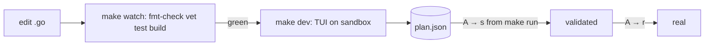

# Development workflow

Related: [architecture.md](architecture.md), [practices.md](practices.md), [apply/sandbox.md](apply/sandbox.md),
[tui/summary.md](tui/summary.md).

## Make targets
| target | does |
|--------|------|
| `make` | `fmt-check` + `vet` + `test` + build `bin/sluice` |
| `make build` / `test` / `vet` / `fmt` / `check` | the obvious |
| `make watch` | `scripts/watch.sh`: re-runs `check build` on every `.go`/`go.mod`/`go.sum` save (inotifywait) |
| `make dev` | `sluice -sandbox` — full reflink clone; clones on first use |
| `make dev-scan` | `sluice -sandbox -scan` |
| `make dev-reset` | `sluice -reset-sandbox -scan` — re-clone from current real mail (~3 s) |
| `make run` / `make scan` | real mail (still plan-first: nothing changes until an apply) |
| `make install` | `check`, then install to `~/.local/bin/sluice` |
| `make install-service` | install + `make install` the binary, copy `contrib/systemd/sluice-sweep.service` to `~/.config/systemd/user`, enable and (re)start it — **run on the machine that should host sweep, not the dev box** |
| `make uninstall-service` / `make service-logs` | disable + remove the unit / follow its journal |
| `make version` | print the version the next build will be stamped with |

## Versioning
`internal/version` holds `Version`, `Commit`, `Branch`, `Date`, stamped by the Makefile with
`-ldflags -X` from git:

```make
VERSION := $(shell git describe --tags --always --dirty 2>/dev/null || echo dev)   # v0.1.0-3-gabc1234-dirty
COMMIT  := $(shell git rev-parse --short HEAD 2>/dev/null)
BRANCH  := $(shell git rev-parse --abbrev-ref HEAD 2>/dev/null)
DATE    := $(shell date -u +%Y-%m-%dT%H:%M:%SZ)
```
Unstamped builds (`go build`, `go run`) fall back to `runtime/debug.ReadBuildInfo` (`vcs.revision`,
`vcs.modified`, `vcs.time`); branch is then unknown. The binary target always relinks so a new
commit/tag is picked up even when no `.go` file changed. Releases are tags `vMAJOR.MINOR.PATCH`.
Shown by `sluice version` / `-version`, `:version`, and the first line of `sluice doctor`.

User-facing docs live in `README.md` (install, quick start, keys, config, file locations); keep it in
sync when flags, keys, config keys or paths change.

Typical loop: terminal 1 `make watch`; terminal 2 `make dev` (restart after green).



## Testing without touching real data
- Everything destructive happens only in `plan.Apply`; unit tests cover it against temp maildirs
  (`internal/plan`, `internal/cleanup`, `internal/sandbox`).
- For manual TUI runs against real mail, pass `-plan <scratch>.json` so the real plan file isn't
  edited; apply with `s` (sandbox) only.
- Sweep: `bin/sluice sweep -sandbox -plan X.json` after copying a message into the sandbox's
  `Mail/+Sluice/cur` (use `find … | xargs grep -il '^List-Id:'`; List-Id header case varies).
- Headless: `bin/sluice -sandbox -plan X.json -apply -yes` applies to the sandbox and prints the report.
- Drive the TUI in tmux (see [tui/summary.md](tui/summary.md#testing)). The first scan of a fresh
  sandbox index takes ~5 s; keys pressed while busy are ignored — wait for "indexed N messages".
- Verification used on 2026-09-24: per-folder file counts of `~/Mail/kolab` + `sha1sum kolab.sieve`
  before/after a real-mode session with a sandbox apply were identical.

## Lessons
- zsh (James's shell): `echo =====` fails (`=word` expansion) and an unmatched glob errors
  (`ls foo*`) — quote them in scripted checks.
- `set -o pipefail` + `ls | head` kills a script with exit 141 (SIGPIPE); use
  `mapfile -t xs < <(… | head)` instead.
- The earlier partial-copy `.dev/` sandbox script was replaced by the built-in full sandbox: a reflink
  clone of everything is faster to build than copying 300 messages per folder.
