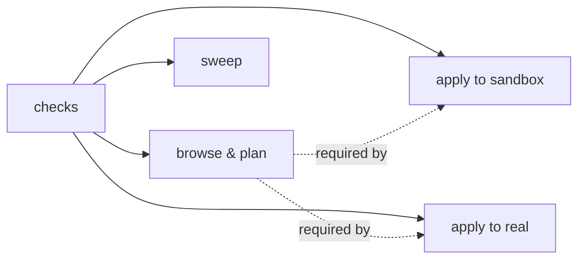

# Doctor (requirements check)

Package: `internal/doctor`. CLI: `sluice doctor [-online] [-config PATH]`; TUI: `:doctor`.
Related: [architecture.md](architecture.md), [mail/maildir-and-mbsync.md](mail/maildir-and-mbsync.md),
[sieve/remote.md](sieve/remote.md), [apply/sandbox.md](apply/sandbox.md).

Doctor is the formal, executable list of what sluice needs. Every check reports **ok / warn / fail**
with a one-line detail and, when not ok, a concrete **fix**. Each check gates one or more
**capabilities**; the summary says which capabilities are usable.



Summary per capability: **✓** ready · **!** usable, but a warning gates it directly (`Degraded`) ·
**✗** blocked — a gating check (or any browse check) **fails** (`Available`). Optional features
(sweep) only ever warn, so a machine that doesn't use them still exits 0.
Exit code: 0 if nothing failed, 1 otherwise — scriptable before a real apply.

## Checks
| check | gates | fail / warn when |
|-------|-------|------------------|
| platform | all | warn: not Linux (flock/reflink assumptions) |
| config | all | fail: config file doesn't parse |
| mail root | all | fail: missing or contains no maildir folders |
| folders | browse | warn: exclude/blackhole/news folders configured but absent (typo) |
| trash folder | real, sandbox | fail: `trash_folder` isn't a maildir (moves + `fileinto` target it) |
| index | browse | fail: index dir not writable / db won't open |
| state | browse | fail: state dir not writable or plan.json corrupt |
| sieve file | real | fail: doesn't parse (bad managed block); warn: missing |
| credentials | real | fail: no `user`/`user_cmd`, or `pass_cmd` executable not found (not run offline); warn: `user` unset, so every publish runs `user_cmd` (`op read` — may wait on a 1Password authorisation) |
| mbsync | real | warn: `mbsync` not on PATH |
| mbsync config | real | warn: no store `Path` equals `mail_root`; `Sync` lacks Push/All (moves never reach server); `Expunge` not Far/Both (originals stay on server flagged deleted) |
| sync lock | real, sandbox | warn: `lock_file` absent (sync wrapper may not flock it → races); warn: held right now |
| sandbox dir | sandbox | fail: invalid (`sandbox.Validate`: absolute, ends in `/sandbox`, no overlap) |
| reflink | sandbox | skipped unless sandbox dir is valid and outside mail_root; warn: reflink copy from mail_root into sandbox parent fails → full copy; fail: not enough free space for a full copy |
| training folder | sweep | warn: `training_folder` (default `+Sluice`) isn't a maildir; fix gives the exact `mkdir` |
| mbsync create | sweep | warn: no `Create Both`/`Far` → a locally created training folder never reaches the server |
| sweep service | sweep | warn: `sluice-sweep.service` not installed (LoadState `not-found`) or not active (fix: `make install-service` / logs) |
| last sweep | sweep | warn: the newest `sweep.jsonl` outcome is `error` (shows reason) |
| post-sweep cmd | sweep | warn: `post_sweep_cmd[0]` not on PATH (moves then wait for the sync timer) |
| sluice on PATH | sweep | warn: `sluice` not found on PATH → `mail-sync` can't call `sluice sweep` (fix: `make install`) |
| server (online) | real | fail: login/list fails; fail: `sieve_script` missing while **another script is active** (never switched off silently); warn: missing and nothing active (first apply creates it); warn: drift; warn: exists but another is active (REAL dialog asks to confirm the switch); warn: nothing active. The detail ends with the session's stage timings, e.g. `[user 0.00s · pass 0.00s · connect 0.12s · starttls 0.55s · auth 0.30s · list 0.12s · get 0.12s · total 1.2s]` |

Offline checks never run credential commands and never write inside `mail_root`: the reflink probe
copies one message *out* of the maildir into a temp file in the sandbox dir's nearest existing
parent, and is skipped when that parent is `mail_root` or inside it (`TestNeverWritesInMailRoot`).
The index and state checks may create sluice's own cache/state dirs.

## Testing
`doctor_test.go` builds a healthy temp environment (maildir, sieve file, lock, mbsyncrc) with a fake
`LookPath`, then breaks one thing per table case and asserts status, fix text and lost capability.
`Options.RemoteStat` fakes the online server check; `Options.ServiceState` fakes systemd. On James's machine every check is ✓ (offline run
~20 ms).

```go
type Check struct {
  Name   string
  Status Status        // OK | Warn | Fail
  Detail string
  Fix    string        // remediation; empty when OK
  Gates  []Capability  // CapBrowse | CapSandbox | CapReal
}
rep := doctor.Run(cfg, doctor.Options{Online: false})
rep.Available(doctor.CapReal) // no failing check gates it
```

`mbsync` config is read from `~/.mbsyncrc` (or `$XDG_CONFIG_HOME/isyncrc`); only `MaildirStore`
`Path`, `Sync` and `Expunge` lines are interpreted.
