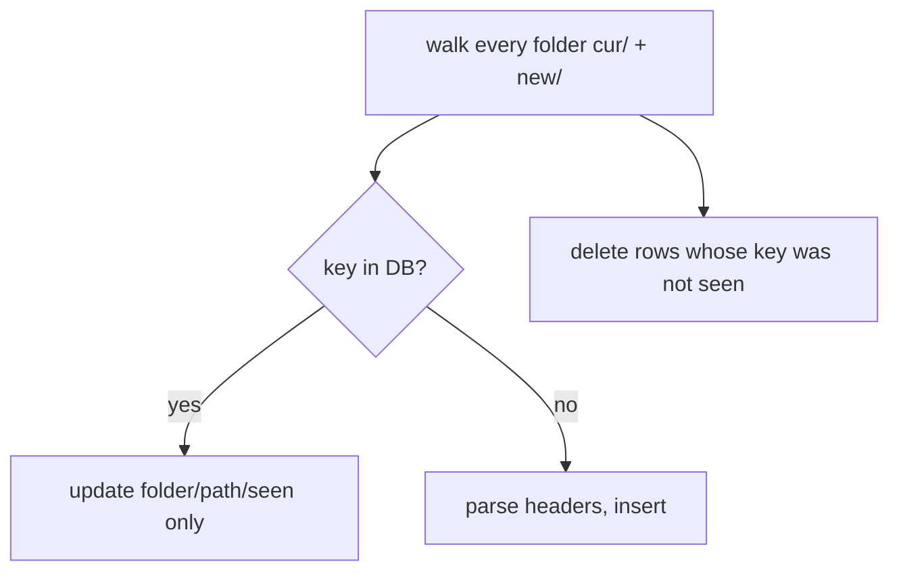

# Header index (SQLite)

Package: `internal/index`. DB at `$XDG_CACHE_HOME/sluice/index.db` (disposable; delete to rebuild).
Related: [maildir-and-mbsync.md](maildir-and-mbsync.md), [../tui/summary.md](../tui/summary.md).

## Schema
```sql
CREATE TABLE messages (
  key         TEXT PRIMARY KEY,  -- maildir key (stable across renames)
  folder      TEXT NOT NULL,
  path        TEXT NOT NULL,     -- absolute current path
  date        INTEGER,           -- unix seconds (Date header, fallback file mtime)
  from_addr   TEXT,              -- lower-cased
  from_domain TEXT,              -- lower-cased, part after '@'
  from_name   TEXT,
  list_id     TEXT,              -- lower-cased, inner <...> of List-Id if present
  subject     TEXT,              -- RFC 2047 decoded
  seen        INTEGER NOT NULL,  -- 1 if S flag
  unsub       INTEGER NOT NULL   -- 1 if List-Unsubscribe present
);
```

## Incremental scan

One transaction per scan. Existing rows are loaded into a map first, so a no-change rescan of
~100k messages is just a directory walk. Excluded folders: config `exclude_folders`
(default `Drafts`, `Sent Messages`, `Sent Items`) — your own mail is never a candidate.

## Groups and score
`index.Groups(kind, now)` aggregates by `list_id` | `from_domain` | `from_addr` (empty keys skipped):
total, count in last 30/90 days, unread, black-hole / news / trash / INBOX counts, any List-Unsubscribe,
and the newest message's `from_name` + `subject`. `max(date)` is the query's **only** min/max
aggregate so SQLite's bare-column rule takes `from_name`/`subject` from the newest row — adding
another `max()`/`min()` silently breaks that.

```go
// Per message: 1.0 if unread OR in a black-hole folder OR in trash; else 0.5 if in a news folder.
ignoredShare := min(sum(ignored)/total, 1)
score := float64(recent90+1) * (0.25 + ignoredShare)
```
Rationale: mail James never opens, or that SaneBox black-holes / he already trashed, is the safest
delivery-time trash target; recent volume dominates so noisy senders rise. Groups that already have
a managed rule stay visible (tagged) and can be hidden in the TUI (`h`).
Black-hole / news folder names come from config (`blackhole_folders`, `news_folders`).

`index.Matching(kind, values, excludeTrash, limit)` is an exact column match — it is what a
managed rule would have caught, and drives retro-apply and group detail. `index.Search(query, limit)`
runs the query language (TUI shows the newest 1000; trash operations fetch all).

## Performance (James's ~97k messages)
Cold scan ≈ 5.5 s (headers parsed on `NumCPU` goroutines); warm rescan ≈ 0.4 s.

## Lessons
- Emarsys senders put a display name in the List-Id brackets (`1023096125 <Wonderbly Books>`), so
  some list values contain spaces/case. Sieve `:contains` is case-insensitive, so rules still match.
- A message present in two folders (same key) is indexed once; the first folder walked wins.

## Invariants
- The index is a cache: correctness never depends on it; moves re-check the file exists.
- Addresses/domains/list ids are stored lower-cased; queries lower-case their inputs.
