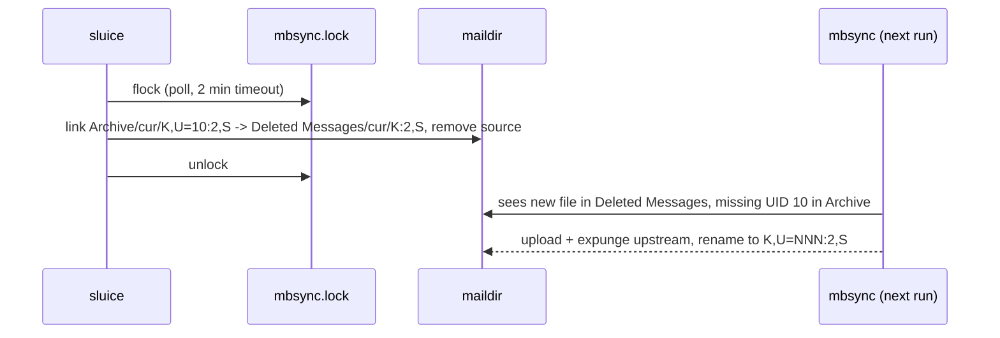

# Maildir layout and mbsync contract

Package: `internal/maildir`. Related: [index.md](index.md), [../cleanup/search-and-trash.md](../cleanup/search-and-trash.md).

## Environment (James's machine)
- Mail root `~/Mail/kolab`, `SubFolders Verbatim`, INBOX at `~/Mail/kolab/INBOX`.
- `~/.mbsyncrc` channel `kolab`, `Create Both`, `Expunge Both`: local moves/deletes propagate upstream.
- `mail-sync` runs `flock -n $XDG_RUNTIME_DIR/mbsync.lock mbsync kolab`, every 15 min (systemd timer)
  plus goimapnotify/aerc triggers.
- Folders (approx. volume): Archive 90k, Sent Messages 8k, +SaneLater 4.6k, Deleted Messages ~1k,
  +SaneNews ~800, +SaneBlackHole ~270, INBOX ~150, Junk, Drafts, Sent Items, +SaneNoReplies, +SaneTomorrow.
- The trash folder is **`Deleted Messages`** (config `trash_folder`).

## Filename anatomy
```
1788208371.122291_10.voyager,U=10:2,RS
└──────── key ────────────┘└UID┘ └info┘
```
`maildir.ParseName` splits a basename into `Key`, `UID`, `Flags`. `Seen` = flags contain `S`.

## Move invariant (from `man mbsync`)
With native UID mapping the MUA must rename files moved between folders; stripping `,U=xxx`
is sufficient. mbsync then uploads the file as a new message to the target folder and expunges
the original. It later re-adds a new `,U=` to the moved file; the key is unchanged, which is what
makes undo possible.

```go
// maildir.Move keeps key + flags, drops U=, always lands in cur/.
dst := filepath.Join(root, toFolder, "cur", n.MovedName()) // key + ":2," + flags
os.Link(src, dst)  // refuses to clobber (rename would overwrite)
os.Remove(src)
```
`maildir.KeyMap(root, folder)` maps key → current path; cleanup caches one map per folder so a
stale index path (flags changed since scan) costs one directory read per folder, not per message.



## Invariants
- Hold `mbsync.lock` (`syscall.Flock LOCK_EX|LOCK_NB`, polled every 500 ms) for the whole batch;
  give up after 2 min with "mbsync is still running".
- Never write into `new/`; moved files go to `cur/` with `:2,<flags>` preserved.
- Never unlink. If the destination exists, skip and report.
- Header parsing reads at most 64 KiB per file (stop at first blank line).

## Lessons / caveats
- mbsync propagates moves as upload+delete, not IMAP MOVE: trashing tens of thousands of
  archive messages re-uploads their full bodies. Expect a long first sync after a big cleanup.
- Many messages lack List-Id (~28% of Archive has one), so the TUI defaults to list grouping but
  domain grouping surfaces the biggest spam senders (e.g. `mail.beehiiv.com`, 1.2k msgs / 90d).
- KolabNow's spam filter prefixes subjects with `***SPAM***`; searchable via `subject:***SPAM***`.
