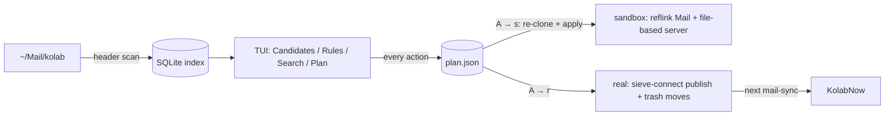

# Sluice — Summary

Sluice is a local-only Go + Bubble Tea TUI that helps James keep a KolabNow mailbox (mirrored to
`~/Mail/kolab` by mbsync, pre-filtered by SaneBox) clean. Its **primary job is the ongoing gate**:
finding the senders and mailing lists that flood in and turning them into delivery-time Sieve rules
(a managed block in `~/.config/sieve/kolab.sieve`) so noise never reaches the inbox. Cleaning up
existing archives is **secondary and mostly one-time**. It indexes maildir headers into SQLite and
ranks groups by volume, unread share and where SaneBox already files them. It is **plan-first**:
every action goes into a persisted plan, and nothing touches mail or the server until the plan is
applied — first to a full reflink sandbox clone to validate, then to real. Real applies publish via
`sieve-connect` (credentials from the `mail-user` / `mail-pass` 1Password helpers) and move messages
into `Deleted Messages` (never deletes) under the mbsync lock, journaled for undo.

Name: a sluice is a gate that controls flow — the rules are the gate; cleanup is the one-off flush.

See [lode-map.md](lode-map.md) for the index, [architecture.md](architecture.md) for packages and
[apply/plan.md](apply/plan.md) for the plan/apply contract.
