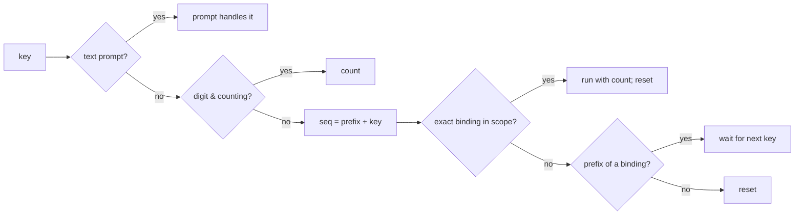

# Vim keymap

Files: `internal/tui/keys.go` (registry, dispatcher, viewport), `internal/tui/cmdline.go` (`:` commands).
Related: [summary.md](summary.md), [../apply/plan.md](../apply/plan.md).

## Dispatcher
Key input outside text prompts goes through one dispatcher with vim semantics:
- **Counts**: digits accumulate (`12j`); `0` with no pending count is a no-op.
- **Prefixes**: `g`, `z`, `d`, `Z` (`prefixKeys` in `keys.go`) wait for a second key — a new
  two-key binding must start with one of these or it is unreachable; the pending `count+prefix` is shown at the
  right of the status line (vim's showcmd). Unknown sequences clear silently.
- **Scopes** are searched most-specific first: overlay (dialog/picker) → tab (candidates / rules /
  search / plan) → list (any list tab) → global.
- While an operation runs (`busy`), only non-action bindings (motions, help, tabs) work.

```go
type binding struct {
  keys  string                           // "j", "gg", "ctrl+d", "dd", "space"
  scope scope
  act   bool                             // mutates plan / starts work: blocked while busy
  help  string
  run   func(m *Model, count int) tea.Cmd // count = 0 when none typed
}
```
The same table generates the `?` help overlay, so help never drifts from behaviour.



## Viewport (`listView{cur, off}`)
Each list keeps its own cursor and scroll offset with `scrolloff = 2`. Moving the cursor scrolls
minimally; `ctrl+e`/`ctrl+y` scroll and drag the cursor; `H`/`M`/`L` are relative to the visible rows.

## Bindings
| scope | keys |
|-------|------|
| global | `h`/`l` or `gT`/`gt` prev/next tab (count repeats) · `{n}gt` tab n · `u` undo plan edit · `ctrl+r` redo · `U` undo applied trash batch · `A` apply · `:` command line · `?` help · `R` rescan · `q` / `ZZ` quit |
| lists | `j`/`k` · `gg`/`G` (`{n}G` line n) · `ctrl+d`/`ctrl+u` half page · `ctrl+f`/`ctrl+b` page · `H`/`M`/`L` · `zz`/`zt`/`zb` · `ctrl+e`/`ctrl+y` · `/` search (not Search tab) · `n`/`N` next/prev match · `V` visual line · `esc` leave visual / clear marks |
| candidates | `space` mark · `gl`/`gd`/`gs` group by list/domain/sender · `s`/`S` next/prev sort · `zh` hide ruled · `enter` detail · `t`/`f`/`r` plan rule · `x` plan trash of existing |
| rules | `dd` plan removal (`{n}dd`, or visual range) · `x` plan trash of existing |
| search | `/` `i` `e` edit query · `X` plan trash of all matches |
| plan | `dd` drop item(s) · `enter` show messages · `D` discard plan |
| dialog | `j`/`k` · `gg`/`G` · `ctrl+d`/`ctrl+u` · `ctrl+f`/`ctrl+b` scroll · action keys (`y`/`s`/`r`) · `esc`/`q` close |

Targets for `t`/`f`/`r`/`x`: visual range if active, else marked rows, else the cursor row.

## Plan undo (`u` / `ctrl+r`)
Every plan mutation snapshots the plan (inside the `plan.Update` lock) onto an in-session undo stack;
a new edit clears redo. Undo/redo write the snapshot back through `plan.Update`. History is dropped
after a real apply (restoring an archived plan would re-apply it). Edits made by another process
(e.g. a sandbox-mode TUI) in between are reverted too — the stack is session-local.

## Command line (`:`)
`tab` completes command names and fixed arguments; `ctrl+p`/`ctrl+n` or `up`/`down` walk history.
| command | effect |
|---------|--------|
| `:q` `:quit` | quit |
| `:{n}` | go to line n |
| `:apply` · `:apply sandbox` · `:apply real` | open apply dialog / go straight to that confirmation |
| `:group list\|domain\|sender` · `:sort score\|90d\|total\|unread` | candidates view |
| `:filter TEXT` · `:filter` (clear) · `:hide` · `:nohide` | narrow candidates |
| `:search QUERY` | Search tab with QUERY run |
| `:w PATH` | write a copy of the plan (the plan itself always autosaves) |
| `:discard` | discard plan (confirm) |
| `:undo` · `:redo` · `:rescan` · `:tab N` · `:help` | as keys |
| `:doctor` | offline requirement report for this environment in a dialog |
| `:version` | build version / commit / branch in the status line |
