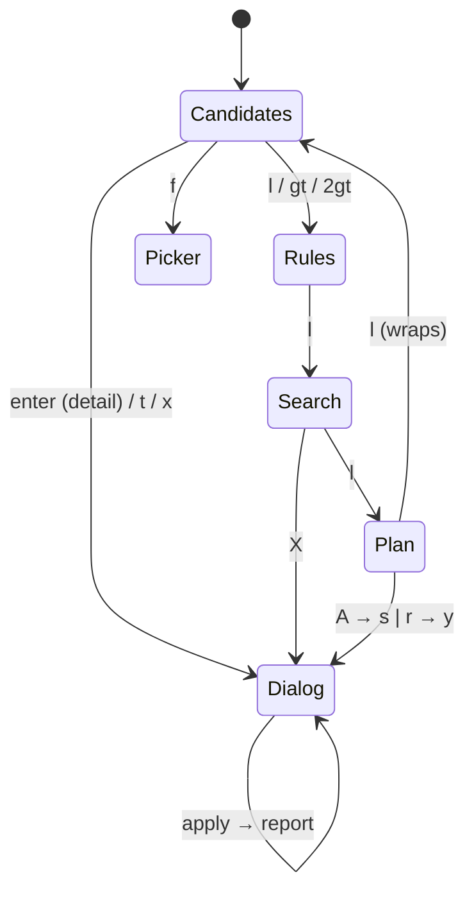

# TUI

Package: `internal/tui` (Bubble Tea, bubbles textinput + spinner, lipgloss).
Related: [../apply/plan.md](../apply/plan.md), [../apply/sandbox.md](../apply/sandbox.md),
[../mail/index.md](../mail/index.md), [../sieve/managed-block.md](../sieve/managed-block.md),
[../cleanup/search-and-trash.md](../cleanup/search-and-trash.md).

**Plan-first:** no key changes mail or the server directly. Actions edit the shared plan file;
`A` applies it. The header shows a `REAL` (red) or `SANDBOX <clone time>` (green) badge and
`plan: N rules · M msgs` (green ✓ when validated).

## Screens


Keys are vim-style; the full keymap, dispatcher, viewport and `:` commands are in [keys.md](keys.md).
Summary: `h`/`l` tabs · `j`/`k` `gg`/`G` `ctrl+d`/`ctrl+u` `H`/`M`/`L` `zz` motions with counts ·
`/` `n` `N` find · `V` visual · `space` mark · `t`/`f`/`r`/`x` plan · `dd` drop/remove · `u`/`ctrl+r`
plan undo/redo · `A` apply · `U` undo applied batch · `:` commands · `?` help.

Targets for `t`/`f`/`r`/`x`: visual range, else marked rows, else `{count}` rows from the cursor.
Group detail and trash-item listings are dialogs (scrollable; detail offers `s` to search the group).

Apply dialog (real mode): full plan summary + collapsed sieve diff + validation status; `s` clones a
fresh sandbox and applies there (marks the plan validated), `r` opens a second "REAL" confirm (`y`).
Sandbox mode offers only `y`. `:apply sandbox|real` jumps straight to those steps. After apply a report
dialog shows per-item moved/planned counts and the sieve log.

Layout: tab bar · body · status line (message or `:`/`/` prompt on the left; `-- VISUAL LINE --` and
pending count/prefix on the right) · one help line.

## Model shape
```go
type Deps struct {
  Env string; Config config.Config; Index *index.Index
  Target plan.Target          // this env
  Sandbox *SandboxTarget      // real mode: {Target, Refresh}
  Created time.Time           // sandbox clone time
}
type Model struct {
  tab tab; ov overlay         // ovNone | ovDialog | ovPicker
  lc, lr, ls, lp listView     // per-list cursor + scroll offset
  keys keyState; visual bool  // pending count/prefix; visual anchor
  groups, view []index.Group; marked map[string]bool
  undoStack, redoStack []*plan.Plan
  base *sieve.Script          // this env's sieve file on disk
  plan *plan.Plan             // reloaded from disk on tab switch / mutation
  dialog dialogState          // title, lines, actions []action{key,label,run}
  busy string                 // non-empty = operation running; action keys ignored, motions work
}
func (m *Model) desired() []sieve.Rule // base rules + plan ops
func (m *Model) mutate(fn func(*plan.Plan) error) error // plan.Update under lock
```
Typed msgs: `scanProgressMsg`/`scanDoneMsg`, `groupsMsg`, `detailMsg`, `searchMsg`, `retroMsg`
(→ plan-trash dialog), `itemMsg`, `undoMsg`, `applyMsg`. Files: `model.go` (state, commands, plan
staging + undo, apply dialogs, `/` prompt), `update.go` (msgs, prompt routing, picker), `keys.go`
(dispatcher, viewport, global/list bindings), `keys_bind.go` (tab/dialog bindings), `cmdline.go`
(`:` commands), `view.go` (rendering, `?` help). Keymap tests: `keys_test.go` drives `Model.key`
with synthetic `tea.KeyMsg`s.

## Testing
Drive headless: `tmux new-session -d -s sb -x 170 -y 45 'bin/sluice -plan /tmp/x.json'`, then
`tmux send-keys` / `tmux capture-pane -p`. Pause between `Escape` and the next key (else alt+key);
wait for the initial scan before sending action keys.
